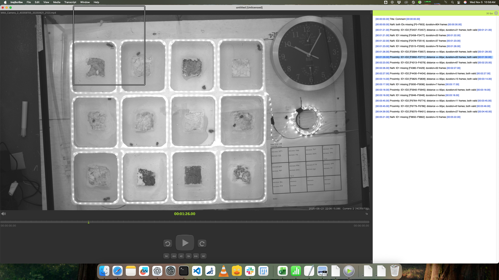
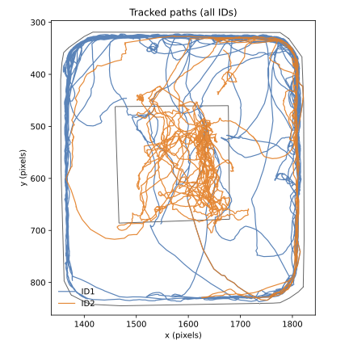

# IDTrackerAI Post‑Processing GUI

## Overview

This GUI allows you to load the outputs from IDTrackerAI and manually correct any misidentifications or errors in the tracking data. It is designed to streamline the post-processing of animal tracking data by providing an intuitive interface to review and edit the results.

## What the Script Produces

- A **pairwise distances CSV** file containing distances between all tracked beetles across all frames. This allows further quantitative analysis of proximity patterns and interactions over time.

- An **InqScribe‑ready tab‑delimited text file** that can be imported directly into InqScribe. This file highlights “events” where two beetles come within the specified distance threshold, as well as periods containing missing data (NAs). These NAs often indicate fights or instances where IDtracker.ai temporarily lost an individual.


- A **PDF visualization** showing the tracked paths of each beetle.  
    
  The figure above shows an example of the PDF generated by the script. It plots the tracked paths of ID1 (blue) and ID2 (orange), marking their trajectories over time within the arena.

## How It Works

1. Load the IDTrackerAI output files into the GUI.
2. Visualize the tracking data frame-by-frame.
3. Use the GUI tools to identify and correct mislabelled individuals.
4. Save the corrected data for further analysis.

## Requirements

- Python 3.7 or higher
- tkinter (usually included with Python)
- numpy
- matplotlib
- pandas

## Installation

1. Clone the repository or download the source code.
2. Install the required Python packages:
   ```
   pip install numpy matplotlib pandas
   ```
3. Ensure tkinter is installed:
   - On Windows and macOS, it usually comes pre-installed.
   - On Linux, you may need to install it via your package manager, e.g., `sudo apt-get install python3-tk`.

## Running the GUI

Run the main script from the command line:
```
python IDTracker_PostProcessing_GUI.py
```
This will open the GUI window where you can load your data and begin post-processing.

### GUI Inputs

1. **Trajectories CSV** – the .csv file exported by IDtracker.ai that contains the x1,y1, x2,y2, etc. columns for each tracked animal. This is the data you want to process.

2. **Distance threshold (px)** – the maximum separation (in pixels) between two animals’ centroids for them to be considered “in contact.” This value determines when a proximity event gets logged in the InqScribe output. Because camera resolution, tracking scale, and even animal size can vary from year to year, you should verify this distance for each batch of videos.

A quick check is to load a representative video frame in Fiji/ImageJ and measure the pixel distance between the centres of two beetles when they’re just touching. In your current setup, 60 px works well for most recordings, but you should re‑measure and adjust this threshold annually.

3. **Min contact duration (s)** – the minimum time that two animals must remain within the distance threshold for the script to register an event. This helps filter out brief, incidental passes.

In your implementation the frame rate is fixed at 30 fps, so a duration of 0.2 s corresponds to 6 frames. This  translates to six seconds in real time (since we record 1 frame per second), which seems reasonable for many interactions. If you want to capture briefer contacts, you could lower the duration to 0.1 s (about 3 frames, or 3 seconds in real time), but very short durations may include spurious touches; if you’re concerned about missing longer interactions, increase the value accordingly.

4. **Output directory** – the folder where the generated files (InqScribe table, tracks PDF, and pairwise distances CSV) will be saved. If you leave it blank, the script defaults to the same directory as the input CSV.

By tuning the pixel threshold and contact duration for each video dataset, you ensure that the proximity events recorded reflect true interactions rather than artifacts of tracking resolution or frame rate.

## CLI Fallback

If you prefer, or if the GUI fails to launch, a command-line interface is available for basic correction operations.

## Notes on macOS/tkinter

On macOS, you may need to install Python from python.org to get a working tkinter installation. The system Python often lacks full tkinter support.

## Project Structure

- `IDTracker_PostProcessing_GUI.py` - Main GUI script
- `README.md` - This documentation
- `requirements.txt` - List of required Python packages
- `data/` - Example data files
- `docs/` - Additional documentation and usage examples

## License

This project is licensed under the MIT License. See the LICENSE file for details.

## Next Steps
- Fix shape of graph so it is not a square
- Run a bunch of tracking runs on differnt cells
- 
